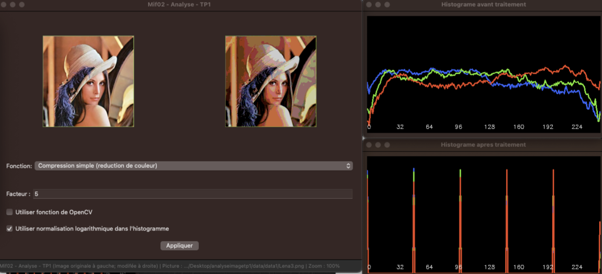
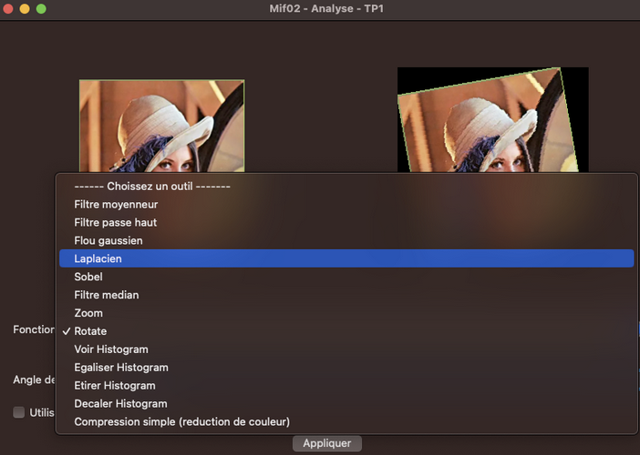

# Application permettant d'effectuer une analyse d'une image

## 🔍 Aperçu du Projet

  
  

Ce projet est une application graphique utilisant wxWidgets et OpenCV. Cette interface permet ainsi de charger des images  et de sélectionner les fonctionnalités à appliquer, telles que l'application de filtres (médian, moyenneur, gaussien, etc.), la visualisation et manipulation des histogrammes (calcul, égalisation, étirement, etc.), ainsi que la réalisation de transformations géométriques comme le zoom.

## 🔄 Installation et Lancement

### Dépendance nécessaires
`brew install opencv`
`brew install wxwidgets`

### Tester avec GUI (par default):

`mkdir build && cd build && cmake .. && make && ./MonProjet`

### Tester avec terminal :

`mkdir build && cd build && cmake .. -DUSE_GUI=OFF && make && ./MonProjet`
